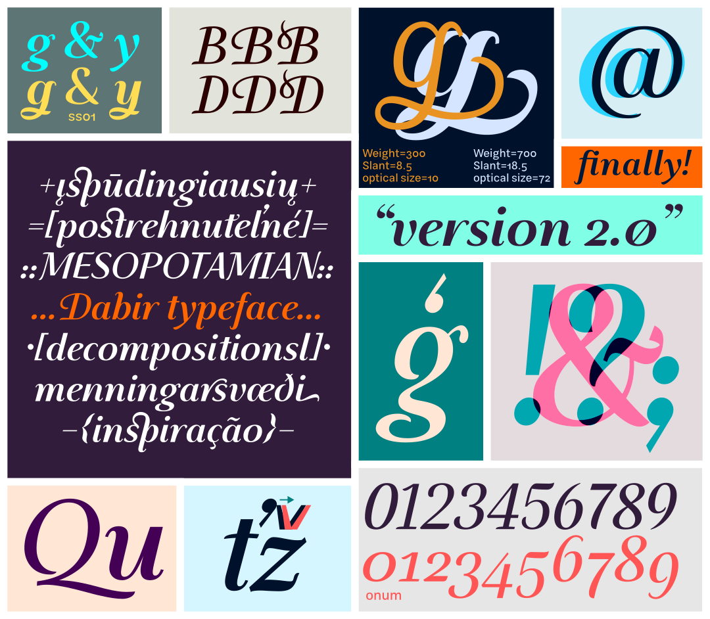
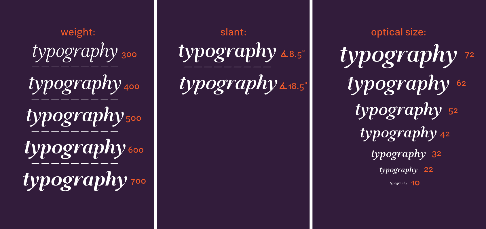
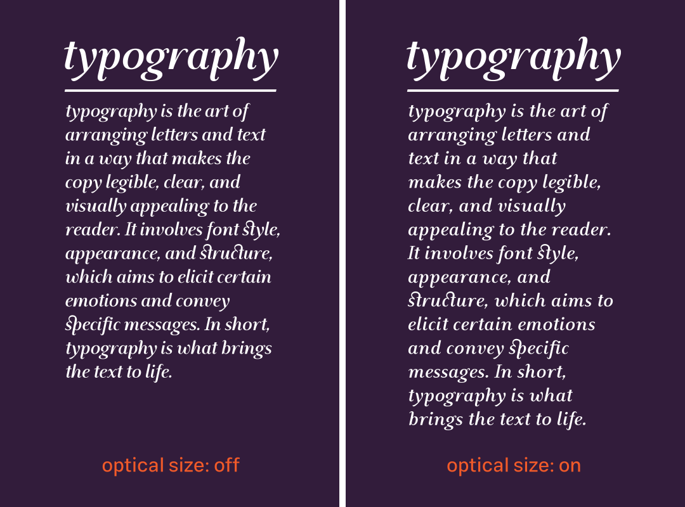

# Dabir

Dabir is an italic serif Latin typeface first designed to complete the Latin part of [Dabir typeface](https://maryamsoft.com/product/fontshop/main/dabir-htm/)(which is a calligraphic perso-arabic type family)
This font has several design connection with the that font and equal(or include in range of) weight, contrast, slant angle… but also has its own identity as a modern italic serif typeface. Dabir supports ~80% of Latin script characters(in decompositional glyph forms), Latin ligatures, slashed zero and old style numbers.

## Variable font Axes:
 **Weight**: 300(Light) to 700(Bold) with nonlinearity
 **Slant**: 8.5° to 18.5°
 **Optical Size**(beta): 10 to 72

 
 optical size axis in this font affecting on glyphs contrast, side bearings and design(in some cases). 

## Build:
Install fontmake and run: `fontmake -o variable -g Dabir.glyphs`
 or from Glyphs app: open file and export variable font(File -> Export -> Variable)
